<!--
 * @Date: 2021-04-07 13:24:35
 * @LastEditors: tortorse
 * @LastEditTime: 2021-04-13 16:09:54
 * @FilePath: \blockly-document-chinese\docs\guides\configure\keyboard-nav.md
-->
# 键盘导航

本指南重点介绍如何使用当前 Blockly 实现的默认键盘导航 。

::: tip 注意
这是一个高度实验的空间，随着越来越多的人在该领域进行测试和研究，我们认为最佳实践可能会经常更改。 如果您想以其他方式配置键盘导航，请参见下面的 [实验性](/guides/configure/keyboard-nav.html#实验性) 章节。
:::

## 使用键盘导航

用户必须能够完成以下任务才意味着键盘导航成功：

- 在工作区中移动

- 连接工作空间上的块

- 将块添加到工作空间

- 分离块

- 导航工具箱

- 导航弹出按钮

- 从弹出窗插入块

下面说明了 Blockly 的默认键盘导航如何完成这些任务的。

### 启用键盘导航

用户可以通过按 **Shift + Ctrl + k** 启用和禁用键盘导航。 首次启用键盘导航时，工作区上会出现一条闪烁的红线。 这是光标。 它显示用户的当前位置并在用户浏览工作区时更新。

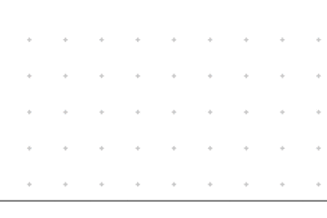

按下 Enter 键会在当前位置创建一条蓝线，描绘用户的标记。 标记显示用于块插入的目标位置。 当您在工作区中移动光标时，它不会更新。

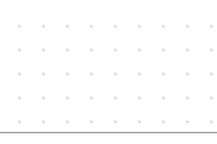

### 使用默认光标

工作空间由输入，字段，连接，块和工作空间坐标组成。 通过将所有组件划分为不同的级别，默认光标在工作区中移动。

要在各个级别之间导航，请使用 **A** 和 **D** 键。 要在关卡中导航，请使用 **W** 和 **S** 键。

#### 工作区层级

通过按 **Shift + Ctrl + k** 进入键盘导航模式。 这会将光标放在工作区或工作区的第一个块上。 如果光标在块上，请按两次A将其移至工作区级别。 要在工作区上移动光标，请使用 **Shift + WASD**。 要移至堆栈级别，请使用 **D** 键。

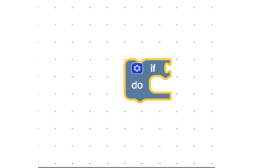

#### 堆栈层级

在堆栈级别，您可以使用 **W** 和 **S** 键在工作空间中的块堆栈之间导航。 在此级别上，光标由堆栈中所有块周围的实心红色矩形表示。 要转到所选堆栈中的第一个程序段，请使用 **D** 键。

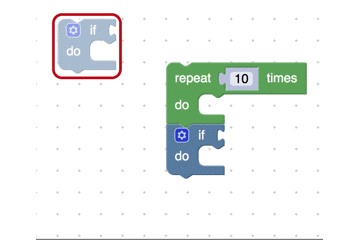

#### 块与连接层级

该级别包含一个块以及该块上的所有外部连接。 如果存在先前的连接或输出连接，则将默认光标设置为跳过该块。 如果两者都不存在，则光标将移动到该块，如下所示。

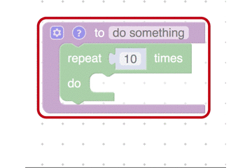

三种可能的外部连接如下所示。

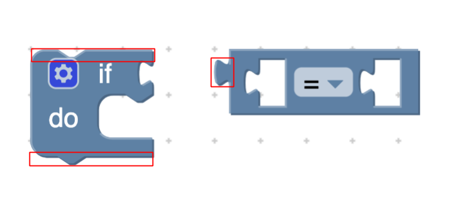

在块和连接级别，您可以使用 **W** 和 **S** 键浏览外部连接。 在此级别，光标由当前连接的闪烁红色轮廓表示。 要转到第一个字段或在块上输入，请按 **D** 键。

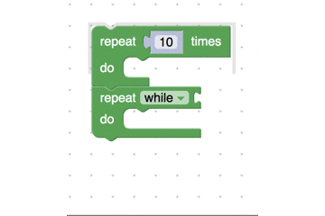

当光标位于一个字段上时，按 **Enter** 键对其进行编辑。

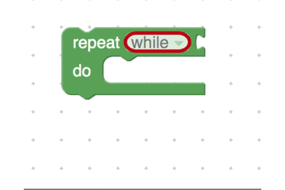

### 在工作区上连接块

1. 使用 **WASD** 键导航到目标连接

2. 使用 **Enter** 键标记连接

3. 使用 **WASD** 键导航到有效的连接点

4. 使用 **I** 键连接两个块（用于插入）

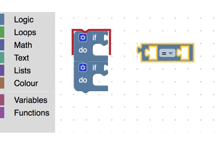

### 在工作区上移动块

通常，在 Blockly 中，您可以通过拾取块，将其拖动到所需位置并释放来将其移动到工作区。 使用键盘快捷键标记目标位置，导航到要移动的块，然后告诉它移动。

1. 使用 **Shift + WASD** 键导航到工作区中的某个位置

2. 使用 **Enter** 键在工作区上标记该位置

3. 使用 **WASD** 键导航到要移动的块

4. 使用 **I** 键将块移动到标记的位置

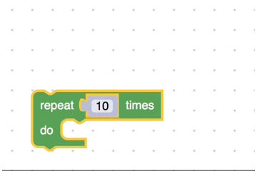

### 拆卸块

通常，在 Blockly 中，您可以通过拾取下级块并将其拖离父级块来断开两个块的连接。 使用键盘快捷键，您可以通过使用要断开的连接上的光标按 **X** 键来断开块的连接。

1. 使用 **WASD** 键导航到要断开的连接
2. 用 **X** 键断开连接

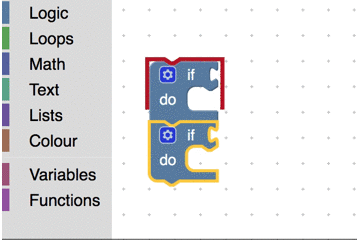

### 从工具箱插入块

1. 按 **T** 键打开工具箱
2. 使用 **W＆S** 键在分类之间移动
3. 按 **D** 键移至弹出窗口中的块
4. 使用 **W＆S** 键浏览块
5. 按 **Enter** 键从弹出菜单中插入一个块

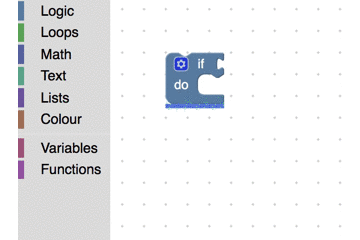

## 实验性

我们相信人们可能会在四个主要领域进行试验：

1. **按键映射**：什么按键应该映射到什么动作。

2. **屏幕阅读器/记录/警告的文本**：屏幕阅读器应如何读取光标位置以及任何错误或警告。

3. **工作区导航**：用户如何浏览工作区上的不同块，字段，输入和连接。

4. **光标外观**：光标和标记的外观。

有关如何使用这些API的更多信息，请查看 Blockly Keyboard Navigation（即将推出）代码实验室。

如果您有其他需要尝试的领域，我们可能会提供帮助，请填写[表单](https://docs.google.com/forms/d/e/1FAIpQLScGAdh8bWLbH3NnUfmMpgpqRCuZrz7qVBtsg-pVT7hz3E32aQ/viewform?usp=sf_link)。

## FAQ

**Q：为什么不使用箭头键进行键盘导航？**

**A**：屏幕阅读器通常使用箭头键。 我们不想干扰这一点，因此选择使用 **WASD** 键盘。
但是，我们认识到每个人都有不同的需求，因此我们强烈建议创建一种简单的方法来更改键映射。

**Q：这看起来很复杂，为什么我们需要不同的层级？**

**A:** 在考虑键盘导航时，我们需要一种结构化的方法来在不同的块，连接，字段，输入和工作区坐标之间移动。
在内部，我们用抽象语法树（AST）表示它。 默认的游标实现不会偏离该模型，这是为了使开发人员更好地了解基础架构。 还有其他光标可能会让最终用户更容易理解。

## 局限性

我们尚不支持导航到非阻塞组件（例如垃圾桶，缩放按钮和弹出菜单）。 有关限制的更多信息，请参见打开的键盘导航 [bug](https://github.com/google/blockly/issues?q=is%3Aopen+is%3Aissue+label%3Akeyboard_nav) 列表。