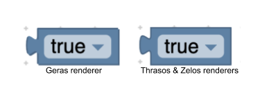

# 主题

主题是自定义 Blockly 外观的一种方式。当前，我们支持通过 Themes 类自定义块颜色，分类颜色和某些组件。 对于任何其他组件，我们在注入 div 上提供主题名称作为类。 这使用户可以通过 CSS 更改任何不受支持的组件的外观。 我们创建主题的主要目标是使开发人员能够创建更易于访问的 Blockly 体验。

但是，强大的力量伴随着巨大的责任。 如果没有特别需要控制块的所有三个样式值（块颜色，边框颜色和影子块颜色），我们强烈建议用户坚持使用 Blockly [颜色](/guides/create-custom-blocks/block-colour)。 很难找到可以很好地搭配使用的颜色，因此最简单的入门方法仍然是使用色调定义颜色，并允许 Blockly 计算边框和影子块的颜色。

## 块样式

块样式目前由四个字段组成：colourPrimary，colourSecondary，colourTertiary和 hat。


```json
{
    "colourPrimary": "#4a148c",
    "colourSecondary":"#AD7BE9",
    "colourTertiary":"#CDB6E9"
}
```

**主色**（必需） - 用作块的背景色，可以用色调或十六进制值定义。

**辅助颜色**（可选） - 如果影子块，则使用此颜色。必须将其定义为十六进制值。

**三级颜色**（可选） - 在 [thrasos](/reference/js/Blockly.thrasos.Renderer) 和 [zelos](/reference/js/Blockly.zelos.Renderer) 渲染器中，这是块的边框颜色。 在 [geras](/reference/js/Blockly.geras.Renderer) 渲染器中，第三色会更改块高光的颜色。



**帽子**（可选） - 当用户想要向其块中添加帽子时使用。 当前，此值的唯一选项是“ cap”。 用户可以在[这里](/guides/create-custom-blocks/block-paradigms#事件驱动程序)找到有关帽子及其用途的更多信息。

## 分类样式

分类样式目前仅包含颜色属性。

```json
{
    "colour":"290"
}
```

**Colour**（必填） - 是弹出菜单上分类的颜色。 此值可以定义为十六进制值或色调。 通常，这些颜色应与类别中大多数图块的 colourPrimary 相同。 这使用户可以轻松分辨出哪些块属于哪个分类。


## 组件样式

我们目前支持更改以下组件的颜色：

- `workspaceBackgroundColour`: 工作区背景色

- `toolboxBackgroundColour`: 工具箱背景色

- `toolboxForegroundColour`: 工具箱分类文字颜色

- `flyoutBackgroundColour`: 弹出窗背景颜色

- `flyoutForegroundColour`: 弹出床文本标签颜色

- `flyoutOpacity`: 弹出床透明度

- `scrollbarColour`: 滚动条颜色

- `scrollbarOpacity`: 滚动条透明度

- `insertionMarkerColour`: 插入标记颜色（不接受颜色名称）

- `insertionMarkerOpacity`: 插入标记透明度

- `markerColour`: 键盘导航模式下显示的标记的颜色

- `cursorColour`: 键盘导航模式下显示的光标颜色

通过使用 CSS 中的主题名称，可以更改大多数其他组件。 但是，如果有一个您要更改的组件尚未包含在此列表中，并且无法使用 CSS 进行更改，请在 [此处](https://github.com/google/blockly/issues/new/choose) 提出问题，以获取更多信息。

## 字体样式

字体样式是一个对象，它包含字体家族，字重和尺寸。

```json
{
    "family": "Georgia, serif",
    "weight": "bold",
    "size": 12
}
```

## 使用主题

为了向您的块应用程序添加主题，需要完成三个步骤：

* 创建一个主题
* 添加样式名称
* 设置你的主题

### 创建一个主题

主题当前既包含块样式的地图，也包含类别样式的地图。

示例块样式图

```json
{
   "list_blocks": {
      "colourPrimary": "#4a148c",
      "colourSecondary":"#AD7BE9",
      "colourTertiary":"#CDB6E9"
   },
   "logic_blocks": {
      "colourPrimary": "#01579b",
      "colourSecondary":"#64C7FF",
      "colourTertiary":"#C5EAFF"
   }
}
```

示例类别样式图

```json
{
   "list_category": {
      "colours": "#4a148c"
   },
   "logic_category": {
      "colour": "#01579b",
   }
}
```

创建主题

```js
var theme = Blockly.Theme(blockStyles, categoryStyles);
```

### 添加样式名称
现在我们已经创建了一个主题，我们需要将样式的名称添加到块和类别定义中。

分类
对于类别，只需将样式标记添加到xml即可。

```html
<category name="Logic" categorystyle="logic_category">
</category>
```

块
如何定义块确定了如何添加样式名称。你可以找到更多的块定义在这里。

JSON:

```json
"style":"logic_blocks"
```

JAVASCRIPT:

```js
 this.setStyle('logic_blocks')
```

### 设置你的主题

现在您已经创建了一个主题并将其连接到您的块和类别，现在是时候告诉我们要使用哪个主题了。

块状选项
设置初始主题的最佳方法是options.theme在您的注入调用中包含。

```
{
    theme: Blockly.Theme(blockStyles, categoryStyles)
}
```

有关选项的更多信息，请[点击此处](https://developers.google.com/blockly/guides/get-started/web#configuration)。如果没有提供主题，则默认为经典主题，可在此处的主题文件夹中找到。

### Blockly Set主题
如果您想动态更改主题（例如，在允许用户从下拉菜单中选择主题的情况下），则可以调用 Blockly.setTheme(theme)。

## 创建块样式脚本
此脚本将采用色调或十六进制值的映射，并将为它们计算seocndary和tert颜色。该脚本可以在theme_script文件夹中找到 。

## 无障碍
我们目前添加了高对比度主题以提高可读性。此样式尚未最终确定，可能会发生变化。在未来，我们希望为具有不同类型色盲的人添加其他主题。