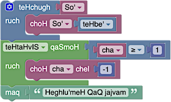

# 克林贡语

2014 年 4 月 1 日，我们发布了 [Blockly 克林贡语翻译](https://blockly-demo.appspot.com/static/demos/code/index.html?lang=tlh&hl=zh-cn#ortpyd)。在翻译方面，克林贡语并不是一个常见的选项。在本页面中，我们希望提供一些怎么做和为什么的上下文，以及您可以如何提供帮助。

## 为什么?

Blockly 已被翻译成 40 多种语言，包括阿拉伯语和希伯来语等 RTL 语言。我们认为，新手程序员必须能够先用自己的语言学习编程的基础知识，然后再过渡到传统的英语编程语言。

从任何意义来说，克林贡语都是真实的语言。这不仅仅是一部影片中堆砌的词语。相反，语言是语言学家几十年来创造的。克林贡语的语法十分复杂，而且完全是独一无二的。

考虑字词顺序。英语遵循 Subject-Verb-Object 顺序（“猫吃东西”）。匈牙利人遵循对象-动词顺序（“猫吃的食物”）。希伯来语遵循动词-对象-顺序（“吃猫食物”）。克林贡语是最奇怪的，按“对象-动词-主题”顺序（“食物吃了猫”）。支持克林贡语是 Blockly 的灵活性的极限测试。块输入需要重新排序，需要添加后缀组，需要重新考虑复数规则。在翻译成克林贡语期间进行的基础架构改进有助于我们支持所有语言。

## 谁?

精通克林贡语的 Google 员工人数远超预期（我们正在招聘）。Google 的克林贡语语言组维护了术语的风格指南，以便不同的应用使用一致的词汇。

我们随时乐于为志愿者提供新的翻译或更正，无论是克林贡语还是其他语言。
## 怎么做?

[Blockly 的大多数翻译](/guides/contribute/core/translating.html) 是由志愿者使用 Translatewiki 完成的。遗憾的是，克林贡语不在他们的语言矩阵中。因此，克林贡语 贡献者需要手动编辑两个文件：

[msg/json/tlh.json](https://github.com/google/blockly/blob/master/msg/json/tlh.json) 和 [demos/code/msg/tlh.js](https://github.com/google/blockly/blob/master/demos/code/msg/tlh.js)

请参阅每个目录中的 `en` 文件，了解英语短语（包括尚未翻译为克林贡语的短语）。我们非常不希望翻译提示消息或帮助网址，除非它们为克林贡语提供有用的上下文。

所有短语 _必须_ 手动翻译。Bing Translate 会生成 `"Library" -> "be'nI''a'wI', Datu'"` 这类翻译，实际上表示 `"discover my big sister"`。显然，在克林贡语环境中不建议这样做。