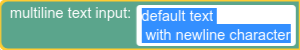
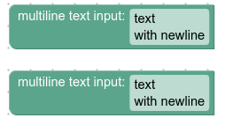
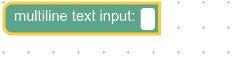

# 多行文本输入框

多行文本输入框将字符串作为其值和文本存储。它的值始终是一个有效的字符串，而它的文本可以是输入到其编辑器中的任何字符串。与文本输入框不同，该字段还支持在编辑器中输入的换行符。

#### 多行文本输入框


#### 打开编辑器的多行文本输入框



#### 折叠块上的多行文本输入框


## 创建

::::tabs
::: tab JSON

```json
{
  "type": "example_multilinetextinput",
  "message0": "multiline text input: %1",
  "args0": [
    {
      "type": "field_multilinetext",
      "name": "FIELDNAME",
      "text": "default text\n with newline character",
      "spellcheck": false
    }
  ]
}
```

:::
::: tab Javascript

```javascript
Blockly.Blocks['example_multilinetextinput'] = {
  init: function() {
    this.appendDummyInput()
      .appendField('multiline text input:')
      .appendField(
        new Blockly.FieldMultilineInput(
          'default text\n with newline character'
        ),
        'FIELDNAME'
      );
  }
};
```

:::
::::

多行文本输入框构造函数接受一个可选的值和一个可选的验证器。该值应转换为字符串。如果它是 `null` 或 `undefined`，将使用空字符串。

JSON 定义还允许您设置 [拼写检查](#拼写检查) 选项。

## 序列化

::::tabs
::: tab JSON
The JSON for a multiline text input field looks like so:

```json
{ "fields": { "FIELDNAME": "line1\nline2" } }
```

其中 `FIELDNAME` 是引用多行文本输入框的字符串，值是应用于该字段的值。该值遵循与构造函数值相同的规则。

:::
::: tab XML
多行文本输入框字段的 XML 如下所示：

```xml
<field name="FIELDNAME">line1&amp;#10;line2</field>
```

其中字段的 `name` 属性包含引用多行文本输入框的字符串，内部文本是应用于该字段的值。内部文本值遵循与构造函数值相同的规则。

:::
::::

## 自定义

### 拼写检查

[setSpellcheck](https://developers.google.com/blockly/reference/js/Blockly.FieldTextInput#setSpellcheck) 函数可用于设置该字段是否对其输入文本进行拼写检查。

### 带有和不带拼写检查的文本输入框



默认情况下，拼写检查是开启的。

这适用于单个字段。如果要修改所有字段，请更改 `Blockly.FieldMultilineInput.prototype.spellcheck_` 属性。

## 创建文本输入验证器

多行文本输入框的值是一个字符串，因此任何验证器都必须接受一个字符串并返回一个字符串、`null` 或 `undefined`。

以下是一个删除字符串中所有 'a' 字符的验证器示例：


```javascript
function(newValue) {
  return newValue.replace(/a/gm, '');
}
```


