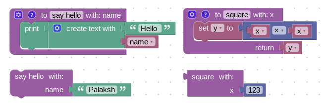

# 过程概述

在计算机科学术语中，过程是一段可重用的代码，用于执行特定任务。

Blockly 将过程实现为一组用于定义过程和调用它的代码生成块。

→ 更多关于 [使用这些块](/guides/create-custom-blocks/procedures/using-procedures.html) 的信息。

→ 更多关于 [创建自定义过程块](/guides/create-custom-blocks/procedures/creating-custom-procedure-blocks.html) 的信息。

→ 更多关于 [创建自定义过程模型](/guides/create-custom-blocks/procedures/creating-custom-procedure-data-models.html) 的信息，这些模型允许您添加新功能，如类型化参数。

## 内置与插件

Blockly 提供了两种实现过程块的方法。

一种存在于插件 [@blockly/block-sharable-procedures](https://www.npmjs.com/package/@blockly/block-sharable-procedures.html) 中，该插件实现了依赖于后备数据模型的过程块。这允许您对过程块执行诸如在一个工作区中存在定义块，而在另一个工作区中存在调用块之类的操作。这个插件是推荐的过程块实现方式。

另一种是 Blockly 核心提供的传统实现。这些块没有后备数据模型，所有关于过程的信息都来自于这些块本身。工作区知道哪些过程可用的唯一方法是通过检查该工作区中包含的过程定义块。这些块将继续得到支持，以实现向后兼容，但大多数开发者应该能够使用插件提供的新块。

- 如果您使用的是 XML 序列化，您可以使用新块，但它们在工作区之间不可共享。该功能需要额外的序列化，仅由 JSON 序列化器提供。在使用 XML 时，新块的行为与旧块相同。[了解更多关于升级到 JSON 的信息](https://docs.google.com/document/d/1wv5ORrO4icVHeU15FLSn37mdNLyJpQbMTo7mmTqsGl0/edit?usp=sharing)。

- 如果您已定义自定义过程块，它们需要 [更新](/guides/creating-custom-blocks/procedures/creating-custom-procedure-blocks.html) 以与新数据模型一起工作。

- 如果您已定义自定义过程定义块，_但使用的是内置过程调用块_，您需要继续使用传统调用块，直到 [更新](/guides/creating-custom-blocks/procedures/creating-custom-procedure-blocks.html) 您的定义块。
