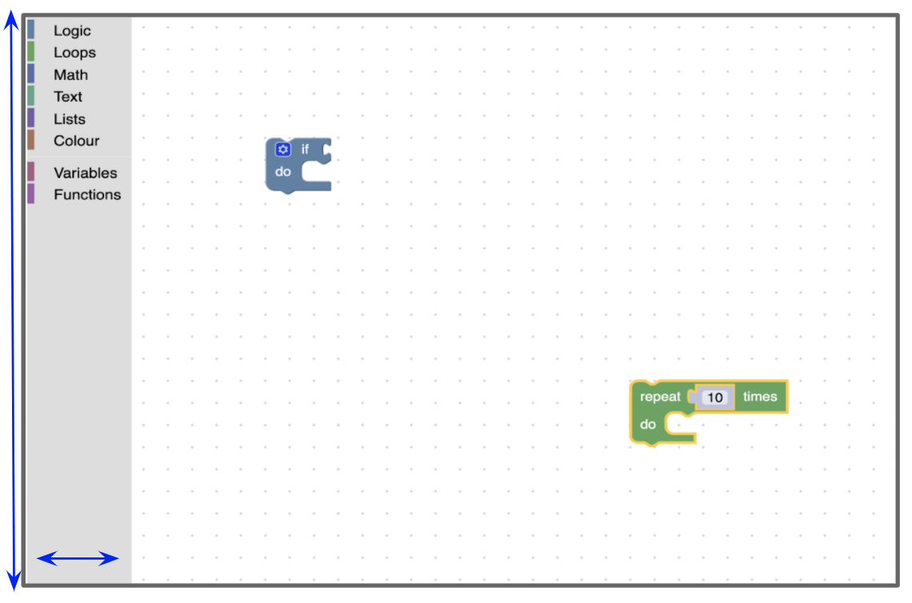
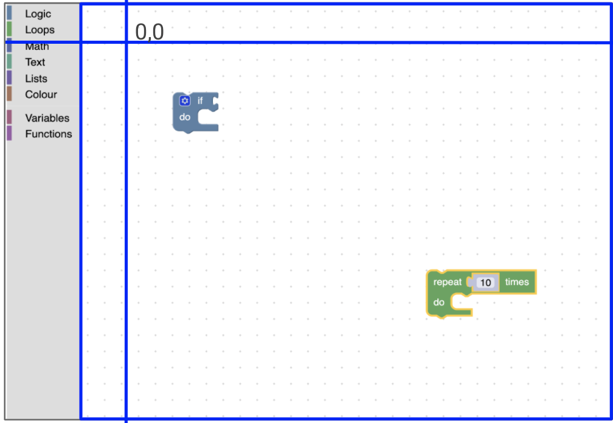
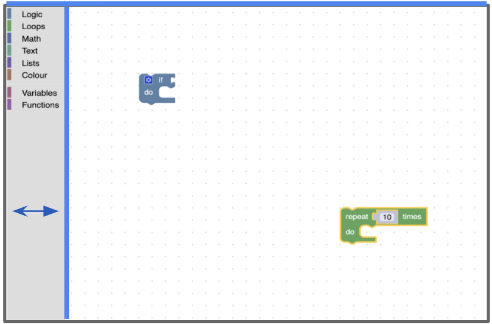
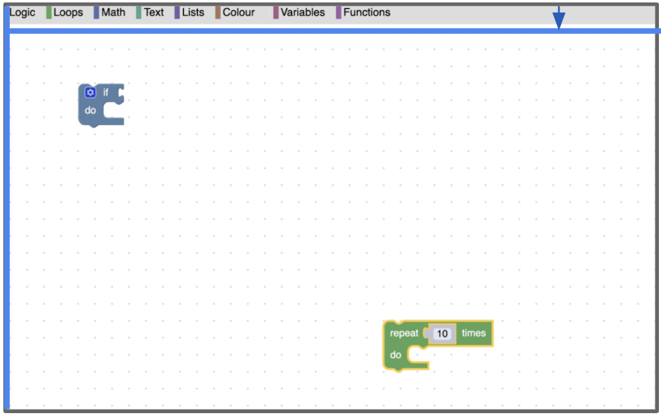
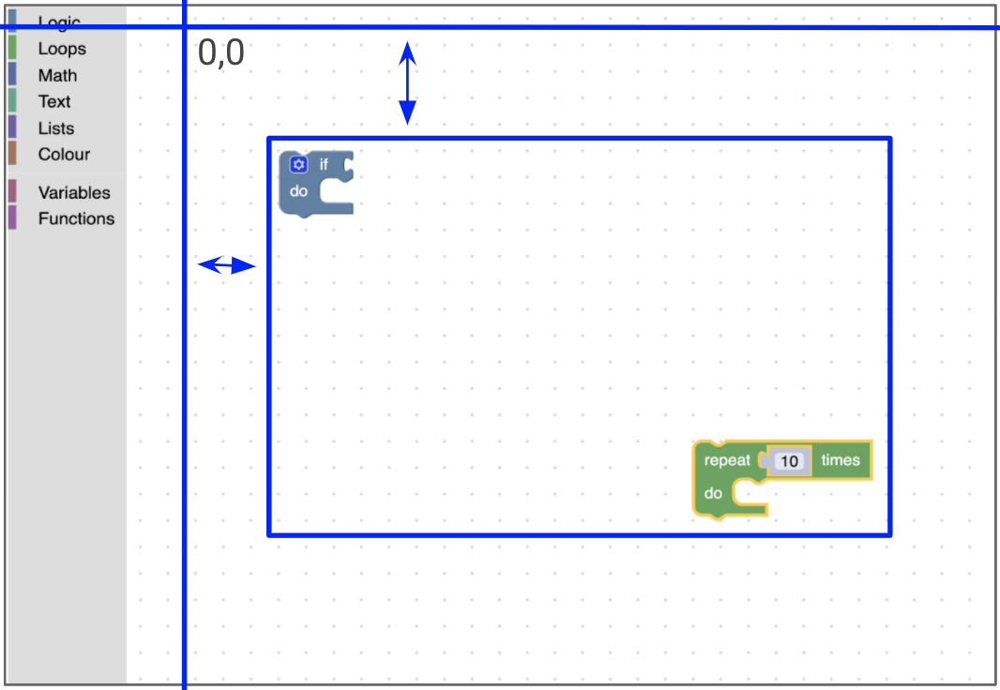

<!--
 * @Date: 2021-10-15 14:06:13
 * @LastEditors: tortorse
 * @LastEditTime: 2021-10-18 09:28:11
 * @FilePath: \blockly-document-chinese\docs\guides\plugins\interfaces\metrics_manager.md
-->
# 度量管理器

The Metrics Manager collects and reports on all metrics pertaining to the Blockly workspace. This guide describes the meaning of each set of metrics returned from the Metrics Manager. For more information on the Metrics Manager you can also watch our [2021 Metrics Deep Dive](https://www.youtube.com/watch?v=6e6vntCqbic&list=PLSIUOFhnxEiCjoIwJ0jAdwpTZET73CK7d&index=9).

度量管理器收集和报告与 Blockly 工作区有关的所有度量。本指南描述了从度量管理器返回的每组度量的含义。有关度量管理器的更多信息，您还可以观看我们的[2021 Metrics Deep Dive](https://www.youtube.com/watch?v=6e6vntCqbic&list=PLSIUOFhnxEiCjoIwJ0jAdwpTZET73CK7d&index=9).。


## 度量

### 工具箱度量

`workspace.getMetricsManager().getToolboxMetrics();`

工具箱度量由 `height`、`width` 和 `position` 类别工具箱组成。这不包括附加到工具箱的弹出窗口的信息。



该工具箱 `position` 属于 `Blockly.utils.toolbox.Position` 类型。


### 弹窗度量

`workspace.getMetricsManager().getFlyoutMetrics();`

弹窗度量由 `height`、`width` 和 `position` 弹出式工具箱组成。需要注意的是，这不是附加到类别工具箱的弹出窗口。这仅适用于弹出工具箱，如下图所示。


该弹窗 `position` 属于 `Blockly.utils.toolbox.Position` 类型。

### SVG 度量

`workspace.getMetricsManager().getSvgMetrics();`

The SVG metrics are composed of the width and height of the workspace's parent SVG. For the main workspace, this is the SVG with the blocklySvg class. This SVG includes the visible workspace as well as the toolbox.

SVG 度量由工作区的父 SVG 的 `width` 和 `height` 组成。对于主工作区，这是带有 `blocklySvg` 类的 SVG 。此 SVG 包括可见的工作区和工具箱。


### 视图度量

`workspace.getMetricsManager().getViewMetrics(opt_getWorkspaceCoordinates);`

视图度量由视口的 `height`，`width`，`top` 和 `left` 组成。视口是工作区中可见的部分。不包括任何一种工具箱。


左上角相对于工作区原点。当我们在工作区中拖动时，视口的顶部和左侧位置会更新。




### 绝对度量

`workspace.getMetricsManager().getAbsoluteMetrics();`

绝对度量由视口相对父 SVG 的 `top` 与 `left` 偏移量组成。根据工具箱在工作区上的位置，它通常是工具箱的宽度或高度。





### 内容度量

`workspace.getMetricsManager().getContentMetrics(opt_getWorkspaceCoordinates);`

内容度量由围绕任意块或工作区注释的盒边界的 `height`，`width`，`top`及 `left` 组成。

:::tip 提示
内容度量不考虑块注释，只考虑 [工作区注释]([https://developers.google.com/blockly/reference/js/Blockly.WorkspaceComment)。
:::



### 滚动度量

`workspace.getMetricsManager().getScrollMetrics(opt_getWorkspaceCoordinates);`

The scroll metrics are composed of the `height`, `width`, `top` and `left` of the scrollable area. For a movable workspace, the scrollable area is the content area plus some padding.

滚动度量由可滚动区域的 `height`，`width`，`top` 和 `left` 组成。对于可移动的工作区，可滚动区域是内容区域加上一些内边距。


## 坐标系

默认情况下，度量管理器计算的所有度量都作为像素坐标返回。在适用的情况下，可以通过传入 `true` 给度量方法来获取工作区坐标中的某些度量。例如， `metricsManager.getViewMetrics(true)`。

```
workspaceCoordinate = pixelCoordinates / workspace.scale
```

工作区坐标通常用于位于工作区上的项目，例如块和工作区注释。工作区坐标不会随着用户放大和缩小而改变。


## 覆盖度量

希望为工作区提供自己的度量标准的开发人员可以注册一个实现了 `IMetricsManager` 接口的替代指标管理器 或扩展 `Blockly.MetricsManager`。

在 [Continuous Toolbox plugin](https://github.com/google/blockly-samples/blob/master/plugins/continuous-toolbox/src/ContinuousMetrics.js) 插件或 [Fixed Edges plugin](https://github.com/google/blockly-samples/blob/master/plugins/fixed-edges/src/index.js)中可以找到一个例子。

